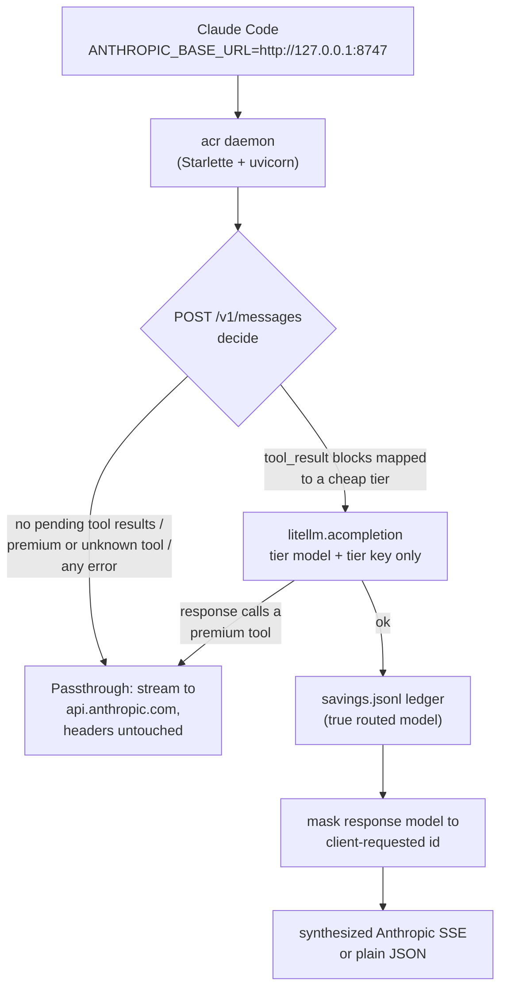

# ai-calls-router

[](https://github.com/maheshkokare/ai-calls-router/actions/workflows/ci.yml)
[](https://pypi.org/project/ai-calls-router/)
[](https://pypi.org/project/ai-calls-router/)
[](LICENSE)
[](https://github.com/pre-commit/pre-commit)

Per-tool-result model routing proxy for Claude Code. It serves the cheap
tool-result-processing turns of a Claude Code session on any LiteLLM-supported
model (DeepSeek, Groq, Kimi, OpenRouter, and others) while keeping every
decision-making turn on your premium Anthropic model and OAuth subscription.

Claude Code spends a large share of its API turns doing mechanical work:
reading a file you just grepped, interpreting a `Bash` result, summarizing a
web fetch. Those turns do not need a frontier model. `ai-calls-router` is a
local reverse proxy that detects them and routes only those turns to a cheaper
model, transparently, while the turns that actually require reasoning go
straight to Anthropic untouched.

It is a standalone proxy, not a Claude Code plugin: Claude Code connects to it
through the standard `ANTHROPIC_BASE_URL` environment variable.

## How it works



A request that carries `tool_result` blocks is processing the output of a tool.
The proxy resolves which tool produced each result, maps it to a serving tier
(`tools:` in the config), and routes the turn to that tier's cheap model. Every
other request -- a fresh user turn, a plain assistant reply, anything mapped to
`premium`, anything it cannot classify -- is streamed straight through to
Anthropic.

## Guarantees

These hold on every turn:

1. The response Claude Code receives always claims the model it asked for, so
   session restore and model display stay correct. Routing is invisible.
2. Your Anthropic OAuth token / `x-api-key` is never forwarded to a routed
   provider. Routed calls carry only that tier's own key. Key values are never
   logged.
3. Any failure on the routing path -- provider error, malformed config, bad
   response -- falls back to a normal Anthropic passthrough. Routing never
   breaks a turn.
4. The savings ledger records the real routed model; only the client-facing
   response is masked.
5. Cost numbers are never fabricated. A model LiteLLM cannot price is left out
   of the ledger rather than guessed at.

## Install

Requires Python 3.11 or newer.

Recommended isolated installs:

```bash
uv tool install ai-calls-router
# or
pipx install ai-calls-router
```

For local development from a checkout, use the repo-managed virtual environment:

```bash
make install
```

`make install` creates `.venv` when missing, reuses it when present, and installs
`ai-calls-router` with development dependencies. Plain `pip install
ai-calls-router` also works, but `uv tool`/`pipx` avoid mixing acr with unrelated
site-packages.

## Quick start

1. Write the default config:

   ```bash
   acr init
   ```

   `acr init` writes `~/.ai-calls-router/config.yaml`. See
   [`config.example.yaml`](config.example.yaml) for the full annotated schema.

2. Provide the API key for your cheap tier. The proxy reads it from the
   environment variable named in your tier's `key_env` field (e.g.
   `DEEPSEEK_API_KEY`). Put it in your shell rc or the proxy's `.env` file:

   ```bash
   # inside ~/.ai-calls-router/.env — process env wins
   echo 'DEEPSEEK_API_KEY=*** >> ~/.ai-calls-router/.env
   ```

3. Start the proxy in the foreground so you can watch routing decisions live:

   ```bash
   acr serve
   ```

4. In another terminal, run **any** normal `claude` command with
   `ANTHROPIC_BASE_URL` pointing at the proxy:

   ```bash
   ANTHROPIC_BASE_URL=http://127.0.0.1:8747 claude
   ```

   That's the entire integration — no special launcher required. The proxy
   intercepts every API call and routes tool-result-processing turns to your
   cheap model transparently; decision-making turns pass straight through to
   Anthropic.

   If you prefer a launcher that also starts the daemon:
   `acr code -- -p "task"`. For persistent routing across all sessions:
   `acr desktop on`.


## How to point Claude Code at the proxy

Claude Code discovers the proxy through the `ANTHROPIC_BASE_URL` environment
variable. Set it any of these ways:

### A. Per-invocation (testing, one-off sessions)

```bash
ANTHROPIC_BASE_URL=http://127.0.0.1:8747 claude
```

No launcher, no config files, no persistence. Combine with `acr serve` in its
own terminal for live log output during testing:

```bash
# Terminal 1 — watch routing decisions log live
acr serve

# Terminal 2 — use Claude Code normally through the proxy
ANTHROPIC_BASE_URL=http://127.0.0.1:8747 claude -p "explain this repo"
```

### B. Shell-level (all terminal sessions)

Add to `~/.zshrc` (or `~/.bashrc`):

```bash
export ANTHROPIC_BASE_URL=http://127.0.0.1:8747
```

Then every `claude` command routes through the proxy automatically. Keep
the daemon running with `acr start` or `acr serve` in its own terminal.

### C. Persistent Claude settings (terminal + IDE + desktop)

```bash
acr desktop on      # write ANTHROPIC_BASE_URL into ~/.claude/settings.json
acr desktop off     # restore the previous value
acr desktop status  # show current state
```

`acr desktop on` writes the proxy URL into `~/.claude/settings.json` under
`env.ANTHROPIC_BASE_URL`. Claude Code reads that file on every launch. The
`off` command restores whatever was there before — including a competing
proxy like Headroom — so you can switch back without losing state.

If `~/.claude/settings.json` already sets `ANTHROPIC_BASE_URL` for another
proxy, `acr desktop on` backs up that value before overwriting it. Mixing
persistent settings with per-invocation or shell-level env vars is redundant;
pick one approach.

All desktop commands accept `--config PATH` for tests or alternate settings
stores.

### D. The `acr code` launcher (also starts the daemon)

```bash
acr code -- -p "explain this repo"
```

`acr code` starts the daemon if needed, injects `ANTHROPIC_BASE_URL` for the
child process only, and runs `claude` with any arguments passed after `--`.
Useful for one-liners where you don't want to manage the daemon separately.

### Troubleshooting

If Claude seems to ignore the proxy:

- Check for a conflicting `ANTHROPIC_BASE_URL` in
  `~/.claude/settings.json` with `acr desktop status`.
- Confirm the proxy is running: `acr status` (daemon) or watch the
  `acr serve` terminal for request logs.
- Inspect `~/.ai-calls-router/acr.log` to see which proxy received traffic.
## Commands

| Command | Purpose |
| --- | --- |
| `acr init` | Generate `config.yaml` interactively. |
| `acr start` | Start the proxy daemon in the background. |
| `acr stop` | Stop the daemon. |
| `acr status` | Report whether the daemon is running, with its pid and URL. |
| `acr code [-- ARGS]` | Boot the daemon if needed and launch `claude` through the proxy. |
| `acr savings` | Print the aggregated routing savings report. |
| `acr serve` | Run the proxy in the foreground (used by the daemon). |
| `acr version` | Print the version. |

## Configuration

The config lives at `~/.ai-calls-router/config.yaml` (override with
`$ACR_CONFIG`). It is reloaded by mtime on each request, so edits apply without
a restart. The key sections:

- `server`: bind host, port (default 8747), and the premium upstream.
- `premium`: reserved for future premium providers; v1 accepts only
  `provider: anthropic`.
- `settings`: tier precedence, compression, and the premium-tool escalation
  guard.
- `tiers`: each cheap tier's LiteLLM model, key environment variable, token
  cap, and optional price overrides.
- `tools`: the tool-to-tier mapping (exact match, then trailing-`*` glob;
  unmapped tools route to premium).

Tier prices are optional. The ledger prices a routed model from LiteLLM's own
pricing table first; supply `input_cost_per_1m` / `output_cost_per_1m` only for
models LiteLLM does not already know. Unpriced models are omitted from the
ledger rather than estimated.

### Compression

Routed turns can be compressed before they are sent to the cheap model to keep
token costs down: the most recent messages are preserved intact and older
`tool_result` text is truncated to a character budget. If the `rtk` CLI is on
your `PATH` and `compression.use_rtk` is `auto`, it is used as the backend;
otherwise a built-in compressor runs. `rtk` is never required.

## State and environment

| Path / variable | Meaning |
| --- | --- |
| `~/.ai-calls-router/config.yaml` | Configuration (`$ACR_CONFIG` overrides). |
| `~/.ai-calls-router/savings.jsonl` | Savings ledger (`$ACR_SAVINGS_LEDGER` overrides). |
| `~/.ai-calls-router/acr.pid` | Daemon pidfile. |
| `~/.ai-calls-router/acr.log` | Daemon log. |
| `$ACR_HOME` | Overrides the state directory root. |

## Limitations

- Routed turns are buffered, not streamed: the escalation guard needs the
  complete response before it can be served, so time-to-first-token on a routed
  turn equals its full completion latency. Decision turns stream normally
  through passthrough.
- v1 supports the Anthropic passthrough only for the premium path.
- The desktop Claude app is out of scope for v1; `acr code` covers the terminal.

## Contributing

See `CONTRIBUTING.md` for development setup and contribution guidelines,
`CODE_OF_CONDUCT.md` for community standards, and `SECURITY.md` for reporting
vulnerabilities.

## License

MIT.
