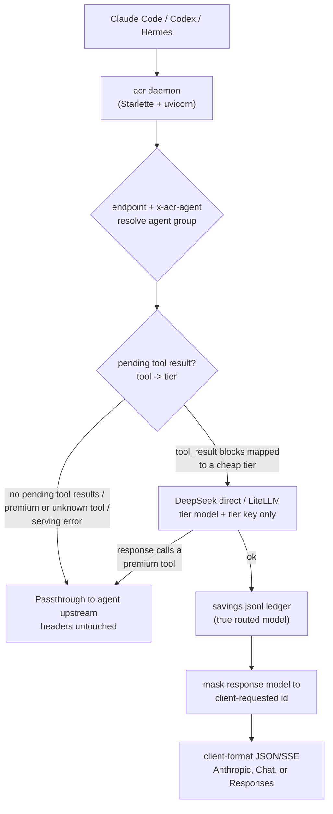

# ai-calls-router

[](https://github.com/maheshkokare/ai-calls-router/actions/workflows/ci.yml)
[](https://pypi.org/project/ai-calls-router/)
[](https://pypi.org/project/ai-calls-router/)
[](LICENSE)
[](https://github.com/pre-commit/pre-commit)

Per-tool-result model routing proxy for Claude Code, Codex, and Hermes. It
serves cheap tool-result-processing turns on any LiteLLM-supported model
(DeepSeek, Groq, Kimi, OpenRouter, and others) while keeping decision-making
turns on each agent's own premium upstream, wire format, and credential.

Claude Code spends a large share of its API turns doing mechanical work:
reading a file you just grepped, interpreting a `Bash` result, summarizing a
web fetch. Those turns do not need a frontier model. `ai-calls-router` is a
local reverse proxy that detects them and routes only those turns to a cheaper
model, transparently, while the turns that actually require reasoning go
straight to Anthropic untouched.

It is a standalone local proxy, not a Claude Code plugin. Claude Code connects
through `ANTHROPIC_BASE_URL`, Codex through `/v1/responses`, and Hermes through
`/v1/chat/completions`. Routed calls are normalized into Anthropic Messages for
the internal serving core; passthrough calls stay byte-for-byte in the client's
native provider format.

## What it supports now

- `POST /v1/messages` for Claude Code and Anthropic Messages clients.
- `POST /v1/chat/completions` for Hermes Chat Completions sessions.
- `POST /v1/responses` for Codex and Responses-speaking Hermes sessions.
- Per-agent tool maps for `claude_code`, `hermes`, and `codex`.
- Per-agent passthrough upstreams, so a non-routed Codex turn goes to OpenAI,
  a Hermes turn goes to its configured upstream, and a Claude Code turn goes to
  Anthropic.
- Provider-specific config files in
  `~/.ai-calls-router/config/{claude-code,codex,hermes}.yaml`.
- Identity routing with `x-acr-agent`, `User-Agent` rules, endpoint defaults,
  and fail-closed unresolved identity.
- Responses and Chat Completions SSE synthesis for routed OpenAI-compatible
  clients.
- DeepSeek direct Anthropic-native serving for cache-stable routed calls.
- Savings accounting, live dashboard, compression stats, and per-session
  request history.

## How it works



A request that carries `tool_result` blocks is processing the output of a tool.
The proxy resolves which tool produced each result, maps it to a serving tier
(`tools:` in the config), and routes the turn to that tier's cheap model. Every
other request -- a fresh user turn, a plain assistant reply, anything mapped to
`premium`, anything it cannot classify -- is streamed straight through to
that agent group's upstream.

## Supported client endpoints

| Endpoint | Default agent group | Client format |
| --- | --- | --- |
| `POST /v1/messages` | `claude_code` | Anthropic Messages |
| `POST /v1/chat/completions` | `hermes` | OpenAI Chat Completions |
| `POST /v1/responses` | `codex` | OpenAI Responses |

`x-acr-agent` has highest precedence and can override the default group when a
client family shares an endpoint. Without that header, the router uses
`router.user_agent_map`, then `router.endpoint_defaults`, then
`router.fallback`, then the adapter default. With a `router:` block and
`fallback: null`, an unmatched request returns `400` with
`{"error": "unresolved agent identity"}` before any upstream call; set an
explicit fallback group only when that is the policy you want.

## Guarantees

These hold on every turn:

1. The response a client receives always claims the model it asked for, so
   session restore and model display stay correct. Routing is invisible.
2. Your premium credential is never forwarded to a routed provider. Routed calls
   carry only the tier key from `key_env`/`env_file`. Passthrough calls forward
   the client's headers verbatim to that agent group's own upstream.
3. Any serving failure on the routing path -- provider error, malformed config,
   bad response -- falls back to that agent group's passthrough. Identity
   attribution is stricter: unresolved identity returns `400`, not a guessed
   upstream.
4. The savings ledger records the real routed model; only the client-facing
   response is masked.
5. Cost numbers are never fabricated. A model LiteLLM cannot price is left out
   of the ledger rather than guessed at.

## Install

Requires Python 3.11 or newer.

Recommended isolated installs:

```bash
uv tool install ai-calls-router
# or
pipx install ai-calls-router
```

For local development from a checkout, use the repo-managed virtual environment:

```bash
make install
```

`make install` creates `.venv` when missing, reuses it when present, and installs
`ai-calls-router` with development dependencies. Plain `pip install
ai-calls-router` also works, but `uv tool`/`pipx` avoid mixing acr with unrelated
site-packages.

## Quick start

1. Write the default config:

   ```bash
   acr init
   ```

   `acr init` writes `~/.ai-calls-router/config.yaml` and creates missing
   provider files under `~/.ai-calls-router/config/`. See
   [`config.example.yaml`](config.example.yaml) for the full annotated schema.

2. Provide the API key for your cheap tier. The proxy reads it from the
   environment variable named in your tier's `key_env` field (e.g.
   `DEEPSEEK_API_KEY`). Put it in your shell rc or the proxy's `.env` file:

   ```bash
   # inside ~/.ai-calls-router/.env — process env wins
   echo 'DEEPSEEK_API_KEY=your-key-here' >> ~/.ai-calls-router/.env
   ```

3. Start the proxy in the foreground so you can watch routing decisions live:

   ```bash
   acr serve
   ```

4. In another terminal, point a client at the proxy:

   ```bash
   # Claude Code / Anthropic Messages
   ANTHROPIC_BASE_URL=http://127.0.0.1:8747 claude

   # Codex / OpenAI Responses
   OPENAI_BASE_URL=http://127.0.0.1:8747/v1 codex

   # Hermes / OpenAI Chat Completions
   OPENAI_BASE_URL=http://127.0.0.1:8747/v1 hermes
   ```

   The proxy intercepts every API call and routes tool-result-processing turns
   to your cheap model transparently. Decision-making turns pass through to the
   active agent group's own upstream with the client's original headers.

   Claude Code also has a launcher that starts the daemon:
   `acr code -- -p "task"`. For persistent Claude Code routing across all
   sessions: `acr desktop on`.


## How to point Claude Code at the proxy

Claude Code discovers the proxy through the `ANTHROPIC_BASE_URL` environment
variable. Set it any of these ways:

### A. Per-invocation (testing, one-off sessions)

```bash
ANTHROPIC_BASE_URL=http://127.0.0.1:8747 claude
```

No launcher, no config files, no persistence. Combine with `acr serve` in its
own terminal for live log output during testing:

```bash
# Terminal 1 — watch routing decisions log live
acr serve

# Terminal 2 — use Claude Code normally through the proxy
ANTHROPIC_BASE_URL=http://127.0.0.1:8747 claude -p "explain this repo"
```

### B. Shell-level (all terminal sessions)

Add to `~/.zshrc` (or `~/.bashrc`):

```bash
export ANTHROPIC_BASE_URL=http://127.0.0.1:8747
```

Then every `claude` command routes through the proxy automatically. Keep
the daemon running with `acr start` or `acr serve` in its own terminal.

### C. Persistent Claude settings (terminal + IDE + desktop)

```bash
acr desktop on      # write ANTHROPIC_BASE_URL into ~/.claude/settings.json
acr desktop off     # restore the previous value
acr desktop status  # show current state
```

`acr desktop on` writes the proxy URL into `~/.claude/settings.json` under
`env.ANTHROPIC_BASE_URL`. Claude Code reads that file on every launch. The
`off` command restores whatever was there before — including a competing
proxy like Headroom — so you can switch back without losing state.

If `~/.claude/settings.json` already sets `ANTHROPIC_BASE_URL` for another
proxy, `acr desktop on` backs up that value before overwriting it. Mixing
persistent settings with per-invocation or shell-level env vars is redundant;
pick one approach.

All desktop commands accept `--config PATH` for tests or alternate settings
stores.

### D. The `acr code` launcher (also starts the daemon)

```bash
acr code -- -p "explain this repo"
```

`acr code` starts the daemon if needed, injects `ANTHROPIC_BASE_URL` for the
child process only, and runs `claude` with any arguments passed after `--`.
Useful for one-liners where you don't want to manage the daemon separately.

### Troubleshooting

If Claude seems to ignore the proxy:

- Check for a conflicting `ANTHROPIC_BASE_URL` in
  `~/.claude/settings.json` with `acr desktop status`.
- Confirm the proxy is running: `acr status` (daemon) or watch the
  `acr serve` terminal for request logs.
- Inspect `~/.ai-calls-router/acr.log` to see which proxy received traffic.

## How to point Codex and Hermes at the proxy

Codex should use the local OpenAI-compatible base URL with its own OpenAI
credential and send `POST /v1/responses` traffic to the router:

```bash
export OPENAI_API_KEY=your-openai-key
OPENAI_BASE_URL=http://127.0.0.1:8747/v1 codex
```

Codex passthrough turns go to `https://api.openai.com` by default, and the
client's own `Authorization` header authenticates that call. Routed turns do
not forward that header; they use only the cheap tier key named in
`config.yaml`. Codex uses the `codex` agent group by default on
`/v1/responses`; add `x-acr-agent: codex` only when a client or wrapper hides
its identity.

Hermes Chat Completions traffic should target the same local OpenAI-compatible
base and send `POST /v1/chat/completions`:

```bash
export OPENAI_API_KEY=your-hermes-upstream-key
OPENAI_BASE_URL=http://127.0.0.1:8747/v1 hermes
```

Hermes defaults to the `hermes` agent group on `/v1/chat/completions`.
Responses-speaking Hermes sessions can still use `/v1/responses`; send
`x-acr-agent: hermes` so the router uses the Hermes tool map instead of the
Codex map.

If a client cannot be identified by endpoint or `User-Agent`, send
`x-acr-agent: codex`, `x-acr-agent: hermes`, or `x-acr-agent: claude_code`.
That header wins over every router rule.

## Commands

| Command | Purpose |
| --- | --- |
| `acr init` | Generate `config.yaml` interactively. |
| `acr start` | Start the proxy daemon in the background. |
| `acr stop` | Stop the daemon. |
| `acr status` | Report whether the daemon is running, with its pid and URL. |
| `acr code [-- ARGS]` | Boot the daemon if needed and launch `claude` through the proxy. |
| `acr savings` | Print the aggregated routing savings report. |
| `acr serve` | Run the proxy in the foreground (used by the daemon). |
| `acr version` | Print the version. |

## Dashboard and accounting

The proxy exposes a local dashboard at:

```text
http://127.0.0.1:8747/dashboard
```

It shows recent requests, routed versus passthrough counts, provider labels,
cache read/write tokens, per-session grouping, agent labels, shrink/compression
stats, and cumulative savings. The dashboard is backed by in-process metrics
plus `~/.ai-calls-router/savings.jsonl`; on startup, the proxy replays the
ledger so routed-token counters and recent routed history survive restarts.

Savings records use the true routed model, not the model name masked back to the
client. Pricing is best-effort: when neither LiteLLM nor configured per-million
prices can price a model, the router skips that savings row instead of inventing
a number.

## Configuration

The global config lives at `~/.ai-calls-router/config.yaml` (override with
`$ACR_CONFIG`). Per-provider files live under
`~/.ai-calls-router/config/{claude-code,codex,hermes}.yaml`. All are reloaded by
mtime on each request, so edits apply without a restart. The global sections:

```text
~/.ai-calls-router/
├── config.yaml
├── config/
│   ├── claude-code.yaml
│   ├── codex.yaml
│   └── hermes.yaml
├── .env
├── acr.log
├── acr.pid
└── savings.jsonl
```

- `server`: bind host, port (default 8747), and the premium upstream.
- `premium`: reserved for future premium providers; v1 accepts only
  `provider: anthropic`.
- `settings`: tier precedence, compression, and the premium-tool escalation
  guard.
- `tiers`: each cheap tier's LiteLLM model, key environment variable, token
  cap, and optional price overrides.
- `router`: identity rules. `x-acr-agent` wins, then
  `router.user_agent_map`, then `router.endpoint_defaults`, then
  `router.fallback`; `fallback: null` fails closed with `400` when identity is
  unresolved.

Example router policy:

```yaml
router:
  endpoint_defaults:
    /v1/messages: claude_code
    /v1/chat/completions: hermes
    /v1/responses: codex
  user_agent_map:
    - contains: claude
      group: claude_code
    - contains: codex
      group: codex
    - contains: hermes
      group: hermes
  fallback: null
```

Provider-file fields actually consumed at runtime:

- `upstream`: passthrough target for that group.
- `tools`: tool-to-tier mapping (exact match, then trailing-`*` glob; unmapped
  tools route to premium).
- `premium_tools`: tools that force passthrough even after a routed response.

Provider-file fields reserved or validated but not behavior-driving in v1:
`auth`, `wire`, `endpoints`, `model_defaults`, `tool_choice`, `reasoning`, and
`fallback`. Provider files must not contain cheap-tier `key_env`; cheap
credentials live only in global `tiers.*.key_env`.

Example provider file:

```yaml
group: codex
upstream: https://api.openai.com
auth:
  mode: oauth_passthrough
wire: responses
endpoints:
  - /v1/responses
tools:
  exec_command: fast
  write_stdin: fast
  update_plan: crud
  apply_patch: premium
premium_tools:
  - apply_patch
  - spawn_agent
  - request_user_input
  - request_plugin_install
fallback: passthrough
```

The `auth` block names a credential source; it is not a secret. Do not put API
keys in provider files. Put cheap-provider keys in environment variables named
by `tiers.*.key_env`, or in `~/.ai-calls-router/.env`.

Tier prices are optional. The ledger prices a routed model from LiteLLM's own
pricing table first; supply `input_cost_per_1m` / `output_cost_per_1m` only for
models LiteLLM does not already know. Unpriced models are omitted from the
ledger rather than estimated.

### Compression

Routed LiteLLM-path turns can be compressed before they are sent to the cheap
model. The optional `headroom-ai` integration is used when installed; otherwise
compression is a no-op and serving continues. DeepSeek direct calls bypass this
compression path so Anthropic-native request bytes stay deterministic for prefix
caching.

Install the optional compressor when you want it:

```bash
uv tool install "ai-calls-router[compression]"
```

## State and environment

| Path / variable | Meaning |
| --- | --- |
| `~/.ai-calls-router/config.yaml` | Configuration (`$ACR_CONFIG` overrides). |
| `~/.ai-calls-router/config/*.yaml` | Per-provider agent config files. |
| `~/.ai-calls-router/savings.jsonl` | Savings ledger (`$ACR_SAVINGS_LEDGER` overrides). |
| `~/.ai-calls-router/acr.pid` | Daemon pidfile. |
| `~/.ai-calls-router/acr.log` | Daemon log. |
| `$ACR_HOME` | Overrides the state directory root. |

## Claude Desktop embedded Claude Code shim

Claude Desktop does not inherit your shell's `ANTHROPIC_BASE_URL`, and its
embedded Claude Code binary may reset the API base URL to Anthropic's default.
For Desktop-launched Claude Code sessions, use the optional binary shim:

```bash
scripts/desktop-shim/apply.sh
```

The installer patches each Desktop-managed Claude Code version under
`~/Library/Application Support/Claude/claude-code/`, saves the original Mach-O
binary as `claude-real`, and replaces `claude` with a wrapper that routes only
the default Anthropic endpoint through `http://127.0.0.1:8747` when ACR answers
`/health`. Custom API endpoints pass through untouched, and a down ACR proxy
does not break Desktop sessions.

To confirm the shim state without changing anything:

```bash
scripts/desktop-shim/apply.sh --status
```

Do not run `scripts/desktop-shim/claude-shim.zsh` directly from the repo; it is
a template that only works after `apply.sh` copies it next to the saved
`claude-real` binary inside Claude Desktop's managed app bundle.

Re-run the script after Claude Desktop updates, because updates create a fresh
version directory. To restore the original binaries:

```bash
scripts/desktop-shim/apply.sh --revert
```

If another shim is already installed and `claude-real` is present, the ACR
installer refuses to overwrite it by default. Use `--force` only when you have
confirmed `claude-real` is the original Desktop-managed binary.

## Limitations

- Routed turns are internally completed before the response is emitted because
  the escalation guard must inspect the full cheap-provider response for premium
  tool calls. Streaming clients still receive client-format SSE, but
  time-to-first-token on a routed turn equals the cheap completion latency.
- Passthrough supports each configured agent upstream in that agent's native
  format. The router does not translate passthrough bodies.
- Azure/OpenAI server-side Responses state is intentionally not implemented.
  Codex/OpenAI requests must be self-contained; unsupported stateful turns should
  passthrough instead of being routed.
- Claude Desktop support requires the optional embedded Claude Code shim above;
  plain shell environment variables are not enough for Desktop-launched sessions.

## Contributing

See `CONTRIBUTING.md` for development setup and contribution guidelines,
`CODE_OF_CONDUCT.md` for community standards, and `SECURITY.md` for reporting
vulnerabilities.

## License

MIT.
