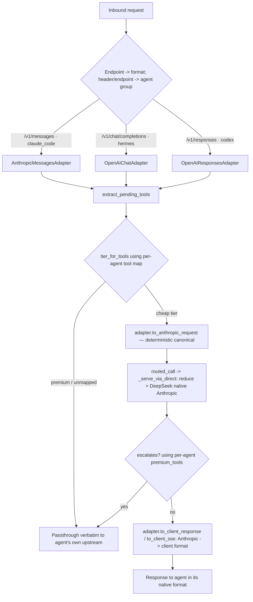

# OpenAI Compatibility Plan

## Phase 0 Investigation

# Plan: OpenAI-call compatibility (Codex + Hermes) with per-agent tool config

Status: APPROVED FOR EXECUTION — implement phase by phase, in order.
Owner: routing layer.
Audience: any engineer or LLM agent executing a single phase cold, with no prior
context from the design conversation. Everything needed is in this document plus
the cited `file:line` references.

---

## 0. How to work in this repo (read first)

- Python target: 3.12 syntax. The local venv interpreter is `.venv/bin/python`
  (CPython 3.13). Always invoke tests through the venv, never bare `python`.
- Prefer Makefile targets. Relevant ones (run `make help` for the full list):
  - `make test` — run the suite.
  - `make lint` — `ruff check`.
  - `make format` — `ruff format` source + tests.
  - `make type` — pyright.
  - `make coverage` — tests with coverage; **fails under 98%**.
  - `make build` — sdist + wheel.
- Direct equivalents if a target is missing: `.venv/bin/python -m pytest`,
  `ruff check`, `ruff format`, `pyright`.
- Coding standards enforced in this repo (do not deviate):
  - Google-format docstrings on every module, class, function, method.
  - A 2–4 sentence module docstring at the top of every new file describing it.
  - Built-in generics (`list[str]`, `dict[str, Any]`); `typing` only for
    `Protocol`, `Callable`, `Literal`, etc.
  - **Immutability**: never mutate an input body/message/dict. Build new objects;
    share unchanged sub-objects; return the original object by identity on no-op
    (see `routing/reduce.py` for the canonical pattern).
  - No nested functions; helpers are module-level.
  - A public function with more than two caller-supplied positional arguments
    makes the rest keyword-only with `*` (see `routed_call` in
    `ai_calls_router/routing/engine.py`).
  - One significant public class per file; `ClassName` -> `class_name.py`.
  - Complexity budget: keep new functions at radon grade A/B.
- Tests are spec-derived and adversarial (see `tests/unit/test_reduce.py` for the
  house style): derive expected values from the contract, cover boundaries and
  error paths, never mirror the implementation, never snapshot-match.

### Non-negotiable serving invariants (every phase must preserve all of these)

1. **Fail open.** Any error in decision, conversion, or the routed call resolves
   to passthrough. Routing must never break a turn. Pattern: catch broadly,
   log at WARNING, return `None`/passthrough (see `_try_route`
   `ai_calls_router/proxy/server.py:73` and `routed_call`
   `ai_calls_router/routing/engine.py:181`).
2. **Credential isolation.** The client's premium credential (Anthropic OAuth /
   OpenAI key) must NEVER reach the routed cheap provider. The routed call uses
   only the tier key resolved from `key_env`/`env_file`
   (`resolve_api_key` `ai_calls_router/routing/decide.py:190`). Passthrough
   forwards the client's own headers verbatim to the client's own upstream.
3. **Accounting never raises into serving.** Savings recording is best-effort and
   must not propagate exceptions into the response path
   (`ai_calls_router/accounting/savings.py`).
4. **DeepSeek cache byte-stability.** Anything that builds the body sent to a
   native-Anthropic (DeepSeek) endpoint must be a deterministic pure function of
   the inbound request, so the cacheable prefix is byte-identical across turns.
   This is the entire reason routed DeepSeek calls bypass LiteLLM and compression
   today (`_serve_via_direct` `ai_calls_router/routing/engine.py:152`). Violating
   it silently destroys the prefix cache — the highest-value property in the
   system.
5. **No hardcoded secrets.** Keys come from env / env_file only.

---

## 1. Goal

Make the router serve tool-result turns for three agent families, not just one:

| Agent group  | Members (collapsed into one group) | Wire format(s)                          | Inbound endpoint(s)        |
| ------------ | ---------------------------------- | --------------------------------------- | -------------------------- |
| `claude_code`| Claude Code CLI + desktop          | Anthropic Messages                      | `POST /v1/messages`        |
| `hermes`     | Hermes CLI + desktop               | **Multi-wire, per-provider** (Phase 0): Chat Completions (default) · Responses · Anthropic Messages | `POST /v1/chat/completions`, `POST /v1/responses`, `POST /v1/messages` |
| `codex`      | Codex CLI + desktop                | OpenAI Responses API (confirmed; Phase 0) | `POST /v1/responses`       |

Hard requirements stated by the product owner:

- **R1.** DeepSeek routing always uses Anthropic style, regardless of inbound
  format, so the DeepSeek prefix cache stays hot (invariant 4).
- **R2.** Reuse the existing tool-router decision logic for Hermes (the
  `headroom-tool-router` port already living in `routing/decide.py`).
- **R3.** Codex integration must be investigated and grounded before coding
  (Phase 0) — its wire protocol and statefulness decide feasibility.
- **R4.** Tool→tier configuration lives in YAML and is consumed by the code; it is
  not hardcoded in the wizard. Defaults are seeded per agent group from a code
  data-module, written into config by the wizard, and read from config at
  runtime.
- **R5.** Default tools are configured per agent group: `codex`, `claude_code`,
  `hermes` (CLI and desktop of each share one group).

---

## 2. Key architectural fact (do not re-derive)

The internal canonical representation is **already Anthropic Messages format**.
The serving pipeline operates entirely on Anthropic bodies; it converts to OpenAI
only for the LiteLLM provider path and converts the response back
(`ai_calls_router/_lib/conversion.py:169`, `:218`). The DeepSeek direct path
sends Anthropic-native verbatim (`ai_calls_router/routing/direct.py`) and
`reduce.reduce_tool_results` keeps it byte-stable
(`ai_calls_router/routing/engine.py:177`).

Therefore the design is **edge conversion, unchanged core**:

```
inbound (any format) --ingress adapter--> Anthropic canonical
        --> existing decide + routed_call + reduce + DeepSeek-direct (UNCHANGED)
        --> Anthropic response --egress adapter--> caller's format (any)
```

Only the routed (DeepSeek) path converts. Passthrough stays a verbatim byte relay
because the client's format already equals its own upstream's format.

### Target flow



---

## 3. File map (what each phase creates or touches)

New:
- `ai_calls_router/routing/agent_defaults.py` — per-agent default tool→tier maps
  + premium lists (data module; Phase 2).
- `ai_calls_router/routing/adapters/__init__.py` — adapter registry + resolution
  (Phase 1).
- `ai_calls_router/routing/adapters/base.py` — `ClientAdapter` Protocol (Phase 1).
- `ai_calls_router/routing/adapters/anthropic_messages.py` — Phase 1.
- `ai_calls_router/routing/adapters/openai_chat.py` — Phase 3.
- `ai_calls_router/routing/adapters/openai_responses.py` — Phase 4.
- `ai_calls_router/_lib/openai_inbound.py` — OpenAI→Anthropic request + tool-def
  conversion, and Anthropic→OpenAI response conversion (Phase 3/4). Keep
  `_lib/conversion.py` focused on the existing LiteLLM direction.
- `ai_calls_router/routing/synthesis_openai.py` — OpenAI chat + Responses SSE
  renderers (Phase 3/4).
- Tests: `tests/unit/test_agent_defaults.py`, `tests/unit/test_adapters_*.py`,
  `tests/unit/test_openai_inbound.py`, `tests/unit/test_synthesis_openai.py`,
  plus integration cases in `tests/` mirroring `test_routed_call.py`.

Changed:
- `ai_calls_router/proxy/server.py` — add routes; thread adapter + agent group
  through `_try_route`; per-agent passthrough upstream.
- `ai_calls_router/routing/decide.py` — `tier_for_tools(..., group)`; per-agent
  tool-map selection; `agents:` schema + flat-config compat shim.
- `ai_calls_router/routing/engine.py` — `escalates(..., group)` reads per-agent
  premium tools; `routed_call` threads `group`.
- `ai_calls_router/ops/wizard.py` — emit `agents:` sections from
  `agent_defaults.py` instead of the hardcoded `DEFAULT_TOOLS`/`PREMIUM_TOOLS`.
- `config.example.yaml` — replace flat `tools:`/`premium_tools:` with `agents:`.
- `docs/` / `README` — document the new endpoints and config.

---

## 4. Config schema change

### Before (current, flat — single agent assumed)

`config.example.yaml:85` `tools:` is one flat map; `settings.premium_tools`
(`:41`) is one flat list; `server.upstream` (`:15`) is the single passthrough
target.

### After (per agent group)

```yaml
agents:
  claude_code:
    upstream: https://api.anthropic.com
    premium: { provider: anthropic }
    tools:                       # Claude Code tool vocabulary (current map)
      Bash: fast
      Read: code
      Grep: code
      Glob: code
      TodoWrite: crud
      Edit: premium
      Write: premium
      # ...full map from ops/wizard.py DEFAULT_TOOLS
    premium_tools: [Edit, Write, MultiEdit, NotebookEdit, Task, ExitPlanMode, AskUserQuestion]

  hermes:
    # Premium = the Hermes session model (provider openai-codex, via Hermes
    # OAuth) — NOT a fixed anthropic endpoint. Resolved per Phase 0 findings.
    upstream: <hermes session-model upstream>    # see phase0-findings.md §6.2
    premium: { provider: openai-codex }
    tools:                       # REAL Hermes vocabulary — routes.yaml (Phase 0)
      terminal: fast
      process: fast
      read_file: code
      search_files: code
      execute_code: code
      skill_view: code
      todo: crud
      memory: crud
      session_search: crud
      skills_list: crud
      write_file: structured     # NOTE: 'structured' tier — see below
      skill_manage: structured
      cronjob: structured
      patch: premium
      clarify: premium
      delegate_task: premium
      browser_vision: premium
      browser_*: premium
    premium_tools: [patch, clarify, delegate_task]

  codex:
    upstream: https://api.openai.com             # default OpenAI provider (Phase 0)
    premium: { provider: openai }
    tools:                       # REAL Codex surface (thin) — Phase 0 §5
      exec_command: fast
      local_shell: fast
      shell: fast
      shell_command: fast
      write_stdin: fast
      update_plan: crud
      get_context_remaining: crud
      apply_patch: premium       # custom/freeform tool; see Phase 4 gaps
      spawn_agent: premium
      request_user_input: premium
      request_plugin_install: premium
      # No native code tier: Codex reads/searches via the shell. A 'code' tier
      # only appears if a filesystem MCP is wired in.
    premium_tools: [apply_patch, spawn_agent, request_user_input, request_plugin_install]
```

`settings:` (env_file, tier_precedence, compression,
escalate_on_premium_tools) stay global and unchanged. **`tiers:` stays global
but must gain a `structured` tier** for the `hermes` group (`write_file`,
`skill_manage`, `cronjob` reference it) — add it to the config `tiers:` schema or
remap those three onto `code`/`crud`. The per-agent config and tier validation
must therefore accept tier names beyond `fast`/`code`/`crud`.

### Compatibility shim (mandatory)

If `agents:` is absent, synthesize a single `claude_code` group from the existing
top-level `tools:`, `settings.premium_tools`, and `server.upstream`. Existing
configs must keep working with zero edits. Add a test that an old flat config
routes identically before and after this change.

---

## 5. Agent group vs adapter (important distinction)

- **Adapter** = wire-format handler, chosen by **endpoint**. Converts request and
  response shapes. One adapter per format.
- **Agent group** = identity used to pick the tool map / premium list / upstream.
  Resolved by `resolve_agent_group(default_for_endpoint, headers)`:
  1. `x-acr-agent` request header if present and valid (`codex|claude_code|hermes`).
  2. else the endpoint default (`/v1/messages`→`claude_code`,
     `/v1/chat/completions`→`hermes`, `/v1/responses`→`codex`).

They are NOT 1:1 — the override is load-bearing, because Hermes is multi-wire
(Phase 0). A Hermes session can arrive on ANY of the three endpoints depending on
its provider: `/v1/chat/completions`, `/v1/responses`, or `/v1/messages`. On
`/v1/responses` both `hermes` and `codex` share the `OpenAIResponsesAdapter` and
must be told apart by `x-acr-agent` to pick the right tool map (Hermes'
`patch`/`terminal`/... vs Codex's `apply_patch`/`shell`/...); likewise a Hermes
Chat session and a future Chat client share `/v1/chat/completions`. So the
endpoint default must be overridable by header. Keep adapter and group decoupled.
(Codex itself is Responses-only; only Hermes spans all three wires.)

---

## 6. Adapter contract (Phase 1 defines; Phases 3–4 implement)

`ai_calls_router/routing/adapters/base.py`:

```python
from collections.abc import Iterator
from typing import Any, Protocol


class ClientAdapter(Protocol):
    """Wire-format handler for one inbound API shape.

    Converts an inbound request to the Anthropic canonical the serving core
    expects, extracts the pending tool names the routing decision needs, and
    converts the Anthropic response back to the caller's native format. All
    methods are pure functions of their arguments and never mutate inputs.
    """

    default_agent_group: str

    def extract_pending_tools(self, body: dict[str, Any]) -> list[str]:
        """Return ordered, deduplicated names of tools whose results this
        request is processing; [] for a turn opener or on shape surprises."""

    def to_anthropic_request(self, body: dict[str, Any]) -> dict[str, Any]:
        """Convert the inbound request to an Anthropic Messages body,
        deterministically (see invariant 4). Never mutates `body`."""

    def to_client_response(self, anthropic_body: dict[str, Any]) -> dict[str, Any]:
        """Convert an Anthropic response body to the caller's native
        non-streaming response object."""

    def to_client_sse(self, anthropic_body: dict[str, Any]) -> Iterator[bytes]:
        """Render an Anthropic response body as the caller's native SSE stream."""
```

The `AnthropicMessagesAdapter` is mostly identity: `extract_pending_tools`
delegates to today's `pending_tool_names`, `to_anthropic_request` returns the
body unchanged, `to_client_response` returns the Anthropic body, `to_client_sse`
delegates to the existing `synthesis.synthesize_sse`.

---

## Phase 0 — Investigation (blocking; no code)

**STATUS: COMPLETE — results in `docs/plans/phase0-findings.md`.** Resolved: Codex
is Responses-only (Phase 4 IN); Codex sends full `input[]` each turn (routable);
Hermes tool map/premium/tiers grounded in the real `routes.yaml`; Hermes inbound
wire is **per-provider multi-wire** (`hermes-agent` `runtime_provider.py:240-341`)
— Chat Completions (default), Responses (openai-codex/xai), or Anthropic Messages
(anthropic/minimax). **Both Phase 3 and Phase 4 have real Hermes consumers; both
ship.** No open items remain (bedrock/codex_app_server out of scope, passthrough).

**Objective.** Replace every "confirm in Phase 0" placeholder with verified fact,
and settle whether Phase 4 (Responses adapter) is needed.

**Steps.**
1. OpenAI Chat Completions tool-call contract — confirm the exact shapes for:
   assistant message `tool_calls[].id` / `.function.name` / `.function.arguments`
   (JSON string); `role:"tool"` result message `tool_call_id` + `content`; the
   `tools[]` function-definition schema; streaming `chat.completion.chunk` deltas
   for tool calls. Source: OpenAI docs via Context7 (`/openai/openai-openapi` or
   the platform docs), cross-checked against the existing Hermes tool router.
2. OpenAI Responses API contract — confirm: `POST /v1/responses` request body;
   `input[]` item types `function_call` (`name`, `arguments`, `call_id`) and
   `function_call_output` (`call_id`, `output`); Codex built-in tool item types
   (e.g. `local_shell`/`local_shell_call`, `apply_patch`) and their output items;
   the streaming event sequence (`response.created`,
   `response.output_item.added`, `response.function_call_arguments.delta`,
   `response.completed`, etc.).
3. **Codex statefulness (decision-critical).** Determine whether Codex sends the
   full `input[]` history every turn (`store:false`) or relies on
   `previous_response_id` server-side state. Inspect the Codex source / config.
   - If full-input: proceed with Phase 4 as written.
   - If server-state-only: the router cannot see history → cannot extract pending
     tools → Codex can only passthrough. Document the required Codex config to
     force full-input mode, or descope Codex routing to passthrough-only.
4. **Codex wire mode (scope lever).** Determine whether the user will point Codex
   at the router via the Responses API or via a Chat-Completions model-provider
   (`wire_api = "chat"`). If Chat, Phase 4 is dropped; Codex reuses the
   `OpenAIChatAdapter` with `x-acr-agent: codex`.
5. Extract the Hermes tool→tier map and premium list from the existing Hermes
   tool router (`~/.hermes/plugins/tool-router/routes.yaml`); record the Hermes
   premium upstream + provider. **DONE:** distinct vocab (`terminal`/`read_file`/
   `patch`/...), adds a `structured` tier, premium=`[patch, clarify, delegate_task]`,
   provider `openai-codex`, premium upstream = Hermes session model.
6. Enumerate the Codex tool vocabulary and assign each tool a tier + premium
   flag. **DONE:** `shell` family→fast, `apply_patch`→premium, multi-agent/
   user-facing/plugin-install→premium, `update_plan`/`get_context_remaining`→crud.
   NOTE: Codex has NO native code-introspection tools (`read_file`/`grep`/`glob`
   are not built in — it reads/searches via the shell), so the `code` tier is
   empty for codex unless a filesystem MCP is wired in.

**Constraints.** Cite a source (doc URL or repo `file:line`) for every shape and
every tool-name decision. No assumptions carried into later phases.

**Verification / done-when.**
- A short `docs/plans/phase0-findings.md` exists containing: verified Chat +
  Responses tool-call schemas with sources; the Codex statefulness answer with
  source; the Codex wire-mode decision; the Hermes tool map + upstream; the Codex
  tool map. Every placeholder in this plan is resolvable from it.
- Decision recorded: Phase 4 IN or OUT.

---

## Phase 1 — Inbound adapter abstraction (no behavior change)

**Objective.** Introduce the adapter seam and route the existing Anthropic path
through it, with zero behavioral change. Pure refactor.

**Preconditions.** None (can start in parallel with Phase 0).

**Steps.**
1. Create `adapters/base.py` with the `ClientAdapter` Protocol (§6).
2. Create `adapters/anthropic_messages.py` implementing the adapter by delegating
   to existing functions (`pending_tool_names`, identity request,
   `synthesis.synthesize_sse`).
3. Create `adapters/__init__.py` with:
   - `adapter_for_path(path: str) -> ClientAdapter | None`
   - `resolve_agent_group(default_group: str, headers) -> str` (§5).
4. Refactor `proxy/server.py`:
   - Generalize `_try_route(body_bytes)` to
     `_try_route(body_bytes, *, adapter, group)`; replace the direct
     `pending_tool_names` call (`server.py:90`) with
     `adapter.extract_pending_tools(body)`; build the Anthropic body via
     `adapter.to_anthropic_request(body)` before `routed_call`; convert the
     result via `adapter.to_client_response` / `to_client_sse` (`server.py:112`).
   - Keep `/v1/messages` wired to `AnthropicMessagesAdapter` +
     `claude_code` group. No new endpoints yet.

**Constraints.** Preserve all five serving invariants. Do not change routing
decisions, savings, or SSE bytes for the Anthropic path. Immutability:
`to_anthropic_request` for Anthropic returns the same object (identity).

**Verification / done-when.**
- `make test` — the full existing suite passes unchanged (no test edits needed
  beyond import wiring). 98% coverage holds.
- `make lint`, `make type` clean; new functions radon A/B.
- Mutation check: temporarily make `extract_pending_tools` return `[]` and
  confirm an existing routing test fails (seam is load-bearing), then revert.

---

## Phase 2 — Per-agent tool config

**Objective.** Move tool defaults out of `wizard.py` into a data module, add the
`agents:` schema, make the decision read per-agent maps, keep old configs working.

**Preconditions.** Phase 1 merged. Phase 0 Hermes/Codex tool maps available (for
seeding defaults; can stub if Phase 0 still running, but real maps required before
Phases 3/4).

**Steps.**
1. Create `routing/agent_defaults.py` (seed from Phase 0 / §4 config example):
   ```python
   AGENT_DEFAULT_TOOLS: dict[str, dict[str, str]] = {
       "claude_code": { ... },   # move ops/wizard.py:84 DEFAULT_TOOLS here verbatim
       "hermes": { ... },        # routes.yaml map: terminal→fast, read_file→code,
                                 #   write_file/skill_manage/cronjob→structured,
                                 #   patch/clarify/delegate_task→premium, browser_*→premium
       "codex": { ... },         # shell family→fast, apply_patch→premium,
                                 #   update_plan/get_context_remaining→crud (no code tier)
   }
   AGENT_DEFAULT_PREMIUM_TOOLS: dict[str, list[str]] = {
       "claude_code": [ ... ],                        # ops/wizard.py PREMIUM_TOOLS
       "hermes": ["patch", "clarify", "delegate_task"],
       "codex": ["apply_patch", "spawn_agent", "request_user_input", "request_plugin_install"],
   }
   ```
   **`structured` tier:** the `hermes` map references a `structured` tier absent
   from the current `tiers:`. Phase 2 must either add `structured` to the config
   `tiers:` schema (and seed it in the wizard) or remap those three tools onto an
   existing tier. Tier-name validation must not hardcode `fast`/`code`/`crud`.
2. `routing/decide.py`:
   - Add `agent_tools(routes, group) -> dict[str, str]` returning
     `routes["agents"][group]["tools"]`, falling back to
     `AGENT_DEFAULT_TOOLS[group]`.
   - Add the **compat shim** (§4): when `routes` has no `agents` key, synthesize a
     `claude_code` group from top-level `tools` / `settings.premium_tools` /
     `server.upstream`.
   - Change `tier_for_tools(names, routes)` ->
     `tier_for_tools(names, routes, *, group)`, using `agent_tools(routes, group)`
     instead of `routes.get("tools")` (`decide.py:157`). `tier_precedence` stays
     global.
3. `routing/engine.py`:
   - Change `escalates(response_body, settings)` ->
     `escalates(response_body, settings, *, premium_tools)` (or thread `group`),
     reading the per-agent premium list instead of `settings.premium_tools`
     (`engine.py:106`). The DeepSeek response names the agent's own tools, so the
     premium check must use the agent's list.
   - Thread `group` through `routed_call` to `escalates`.
4. `proxy/server.py`: pass `group` into `tier_for_tools` and `routed_call`.
5. `ops/wizard.py`: replace `DEFAULT_TOOLS`/`PREMIUM_TOOLS` usage
   (`wizard.py:84`, `:106`, `:226`, `:222`) with an `agents:` block built from
   `agent_defaults.py`. Add per-agent `upstream`/`premium`.
6. `config.example.yaml`: replace the flat `tools:` and `settings.premium_tools`
   with the `agents:` block (§4). Keep `tiers:`/`settings:` global.

**Constraints.** Immutability and fail-open preserved. The compat shim must make a
pre-existing flat config route byte-identically to before. `agent_defaults.py`
holds data only — no IO, no logic. Per-agent premium-tool list drives the
escalation guard correctly (Claude `Edit`, Codex `apply_patch`, etc.).

**Verification / done-when.**
- New `tests/unit/test_agent_defaults.py`: every group has a non-empty tool map;
  every tier referenced exists in `tiers`; every premium tool maps to `premium`.
- `decide.py` tests: `tier_for_tools` with `group="codex"` resolves Codex names;
  with `group="claude_code"` matches today's behavior; unknown tool → premium;
  mixed batch → highest precedence; **compat shim**: a config lacking `agents:`
  resolves the same tier for the same Claude tools as before.
- `engine.py` tests: a routed response calling a group's premium tool escalates
  (returns `None`); calling another group's premium-but-not-this-group tool does
  not.
- `wizard.py` tests (`tests/unit/test_wizard.py`): generated config contains all
  three `agents:` groups with tools + premium_tools + upstream; round-trips
  through `decide.load_routes`.
- `make test`/`lint`/`type` clean; coverage ≥ 98%.

---

## Phase 3 — OpenAI Chat Completions adapter (Hermes)  [IN per Phase 0]

**Objective.** Serve `POST /v1/chat/completions` for Hermes end to end: OpenAI
request → Anthropic canonical → DeepSeek direct → OpenAI response (non-stream +
SSE).

**Preconditions.** Phases 1–2 merged; Phase 0 Chat contract verified. **Confirmed
consumer:** a Hermes session on any chat-completions provider — qwen/gemini/nous/
openrouter or any custom OpenAI-compatible provider, which is the DEFAULT Hermes
`api_mode` (`hermes-agent` `runtime_provider.py:308-341`). Not droppable.

**Steps.**
1. `_lib/openai_inbound.py` — request direction (inverse of the existing
   `_lib/conversion.py` emitters at `:126`–`:159`):
   - `openai_chat_to_anthropic_messages(messages) -> list[dict]`: assistant
     `tool_calls` → `tool_use` content blocks (`id`=`tool_calls[].id` verbatim,
     `name`, `input`=parsed `arguments`); `role:"tool"` messages →
     `tool_result` blocks (`tool_use_id`=`tool_call_id` verbatim); `system` →
     Anthropic `system`; user/assistant text → text blocks.
   - `openai_tool_to_anthropic(tool) -> dict` (inverse of `convert_anthropic_tool`
     `conversion.py:34`): `function.name/description/parameters` →
     `name/description/input_schema`.
   - `chat_request_to_anthropic(body) -> dict`: assemble the full Anthropic body
     (model, messages, system, tools, tool_choice, max_tokens, temperature,
     top_p, stop). **Deterministic**: fixed key order, verbatim id passthrough,
     preserve argument-object key order, inject nothing nondeterministic.
2. `_lib/openai_inbound.py` — response direction:
   - `anthropic_to_chat_response(anthropic_body) -> dict`: Anthropic `content`
     (text + `tool_use`) → `choices[0].message` (`content` + `tool_calls` with
     `arguments` re-serialized to JSON string); map `stop_reason`→`finish_reason`;
     map usage.
3. `routing/synthesis_openai.py`:
   - `synthesize_chat_sse(anthropic_body) -> Iterator[bytes]`: emit
     `chat.completion.chunk` events (role delta, content/tool-call deltas,
     final `finish_reason`, `[DONE]`).
4. `adapters/openai_chat.py`: `OpenAIChatAdapter` wiring the above;
   `extract_pending_tools` = last `role:"tool"` message's `tool_call_id`s matched
   to prior assistant `tool_calls[].function.name` (return `["<unknown>"]` on an
   unresolvable id, mirroring `pending_tool_names` `decide.py:119`).
5. `proxy/server.py`: add `Route("/v1/chat/completions", chat_completions,
   methods=["POST"])`; the handler resolves the adapter + group and calls the
   generalized `_try_route`, then `_serve_passthrough` to the **hermes** upstream
   on `None`.

**Constraints.**
- Invariant 4 (byte-stability): `chat_request_to_anthropic` must be a pure
  deterministic function — verbatim `tool_call_id` passthrough, stable field
  order, preserved argument key order. No `uuid`/timestamp in the request path.
- Invariant 1: malformed OpenAI body, unconvertible message, or conversion error
  → return `None` → passthrough.
- Reuse, do not reimplement, the decision and serving core. `reduce` runs
  automatically because the routed body goes through `_serve_via_direct`.

**Verification / done-when.**
- `tests/unit/test_openai_inbound.py` (spec-derived): tool_call→tool_use round
  trip; tool result message→tool_result; tool-def conversion; system handling;
  text-only turns; **byte-stability across two turns** — convert turn N and turn
  N+1 sharing a prefix, assert the serialized shared prefix is byte-identical
  (mirror `test_same_tool_result_reduces_identically_regardless_of_position` in
  `tests/unit/test_reduce.py`); immutability (input not mutated); arguments with
  ordered keys survive round trip; unparseable arguments handled.
- `extract_pending_tools` tests: resolvable ids → names; unresolvable id →
  `["<unknown>"]`; turn opener → `[]`.
- `test_synthesis_openai.py`: SSE byte sequence matches a hand-written golden for
  a text response and a tool-call response.
- Integration (mirror `tests/unit/test_routed_call.py` harness): a Hermes
  `/v1/chat/completions` tool-result turn routes to DeepSeek direct and returns a
  valid `chat.completion`; a premium-tool turn passes through to the hermes
  upstream.
- `make test`/`lint`/`type` clean; coverage ≥ 98%.

---

## Phase 4 — OpenAI Responses adapter (Codex, maybe Hermes)  [IN per Phase 0]

**Objective.** Same as Phase 3 for `POST /v1/responses`. Phase 0 confirmed Phase
4 = IN (Codex is Responses-only and sends full input each turn). **This adapter
also serves Hermes sessions running on `openai-codex`/`xai`** (which emit
`codex_responses` — D3), resolved to the `hermes` tool map via `x-acr-agent`.
Phase 3 still ships independently for Hermes chat-completions sessions.

**Preconditions.** Phases 1–2 merged. Independent of Phase 3 — Phases 3 and 4 are
separate adapters that can land in either order; do NOT couple them.

**Steps.**
1. `_lib/openai_inbound.py` — Responses request direction:
   - `responses_input_to_anthropic_messages(input) -> list[dict]`: `function_call`
     items → `tool_use` blocks (`id`=`call_id` verbatim); `function_call_output`
     items → `tool_result` blocks (`tool_use_id`=`call_id`); Codex built-in tool
     items (`local_shell`/`apply_patch` and their outputs) mapped per Phase 0
     findings; `instructions`/system → Anthropic `system`; message items → text.
   - **Strip inbound `Reasoning` items** (they carry `encrypted_content`) before
     building the canonical body — mirror `_strip_thinking_from_messages`
     (`engine.py:35`). Leaving them in makes the DeepSeek prefix non-deterministic
     and breaks the cache (invariant 4).
   - `responses_request_to_anthropic(body) -> dict`: assemble deterministically
     (same byte-stability rules as Phase 3).
2. `_lib/openai_inbound.py` — Responses response direction:
   - `anthropic_to_responses(anthropic_body) -> dict`: Anthropic content →
     Responses `output[]` items (`message` + `function_call`); map usage + status.
3. `routing/synthesis_openai.py`: `synthesize_responses_sse(anthropic_body)` —
   emit the Responses event sequence verified in Phase 0. **Streaming is the live
   path:** Codex ALWAYS streams, so this synthesizer (not a JSON body) is the real
   egress; the non-streaming path is effectively dead for codex but kept for tests.
4. `adapters/openai_responses.py`: `OpenAIResponsesAdapter`;
   `extract_pending_tools` = `function_call_output.call_id`s matched to
   `function_call.name`. **`apply_patch` is a custom/freeform tool** — its result
   can arrive as `CustomToolCallOutput`; the call/output name-match (and the
   premium-escalation guard) must cover custom-tool items, not only
   `FunctionCall`/`FunctionCallOutput`. **Hosted-tool items** (`WebSearchCall`,
   `ImageGenerationCall`) are not `function_call_output`, carry no routable name,
   and are inert for tier selection — skip them without crashing.
5. `proxy/server.py`: add `Route("/v1/responses", responses, methods=["POST"])`;
   passthrough to the **codex** upstream on `None`.

**Constraints.** Same as Phase 3, plus: if `extract_pending_tools` cannot see the
matching `function_call` for an output (history not sent), return `["<unknown>"]`
so the turn safely passes through rather than mis-routing.

**Verification / done-when.** Same battery as Phase 3, retargeted to Responses
shapes: round-trip conversions, byte-stability across two turns, immutability,
golden Responses SSE, integration through DeepSeek direct, premium passthrough to
the codex upstream. `make test`/`lint`/`type` clean; coverage ≥ 98%.

---

## Phase 5 — Per-agent premium upstream / passthrough

**Objective.** A non-routed (premium/unmapped/opener) turn replays to the agent's
own upstream in the agent's own format, not always Anthropic.

**Preconditions.** Phase 2 merged (config carries per-agent `upstream`); Phases
3/4 for the OpenAI groups.

**Steps.**
1. `proxy/server.py` `_serve_passthrough` (`server.py:50`): select the upstream
   from `routes["agents"][group]["upstream"]` (compat shim → `server.upstream`)
   instead of the single `settings.upstream`.
2. Thread `group` into `_serve_passthrough` from each endpoint handler.
3. Confirm credential isolation (invariant 2): passthrough still forwards the
   client's own headers verbatim to the client's own upstream — no tier key, no
   cross-provider credential leakage.

**Constraints.** No conversion on passthrough (client format == upstream format).
Fail-open preserved.

**Verification / done-when.**
- Tests: a `claude_code` passthrough hits the anthropic upstream; a `hermes`/
  `codex` passthrough hits its configured upstream; client headers are forwarded
  unchanged; no tier key appears in passthrough requests.
- `make test`/`lint`/`type` clean; coverage ≥ 98%.

---

## Phase 6 — Docs, example config, end-to-end checks

**Objective.** Make the feature usable and documented.

**Steps.**
1. `config.example.yaml`: finalized `agents:` block for all three groups with real
   tool maps from Phase 0.
2. `README` / `docs/`: document the three endpoints, the `agents:` schema, the
   `x-acr-agent` override, and how to point Codex / Hermes at the router.
3. End-to-end smoke (manual or scripted): drive a real tool-result turn from each
   agent through the router; confirm a routed DeepSeek response and a sane premium
   passthrough.

**Verification / done-when.**
- `acr init` (wizard) produces a config that `decide.load_routes` parses and that
  routes all three groups in tests.
- Example config validates; docs reviewed.
- Full suite green at ≥ 98% coverage; `make lint`/`type` clean.

---

## 7. Cross-cutting verification (run after every phase)

```
make format
make lint
make type
make coverage     # must report >= 98%
```

Plus, for any code that builds a body destined for a native-Anthropic endpoint,
a **byte-stability test**: convert two consecutive turns that share a prefix and
assert the serialized shared prefix is byte-identical. This is the executable
proxy for "the DeepSeek prefix cache still hits." Treat a failure here as a
release blocker, not a warning.

---

## 8. Risks and mitigations

| # | Risk | Impact | Mitigation |
|---|------|--------|------------|
| 1 | Codex relies on `previous_response_id` server state | Router can't see history → can't route Codex | RESOLVED in Phase 0: standard OpenAI provider sends full `input[]` each turn (`store:false`). Only Azure stores server-side → Azure descoped to passthrough. |
| 2 | OpenAI→Anthropic conversion is non-deterministic | Silent DeepSeek cache misses (defeats the whole point) | Pure functions, verbatim id passthrough, stable field order, byte-stability tests (invariant 4) |
| 3 | Three SSE dialects (Anthropic / chat.chunk / Responses) | Streaming clients break | Golden-pair SSE tests per dialect (Phase 3/4) |
| 4 | Wrong per-agent premium-tool mapping | Escalation guard misfires; cheap model performs premium action | Per-agent `premium_tools`; escalation tests per group (Phase 2) |
| 5 | Argument JSON round-trip reorders keys/normalizes floats | Cache misses | Preserve key order; do not reformat; test |
| 6 | Flat-config users regress | Existing deployments break | Mandatory compat shim + regression test (Phase 2) |

---

## 9. Open decisions (Phase 0 results recorded in phase0-findings.md)

- **D1. Codex wire mode** — RESOLVED: Responses API only (Codex removed Chat;
  `wire_api="chat"` hard-errors). Phase 4 IN.
- **D2. Codex statefulness** — RESOLVED: full `input[]` history sent every turn
  (`store:false` except Azure). Codex routing is feasible (risk #1 retired for the
  standard OpenAI provider; Azure is descoped to passthrough).
- **D3. Hermes wire details** — RESOLVED: tool map / premium list / tiers
  GROUNDED in the real `~/.hermes/plugins/tool-router/routes.yaml` (distinct vocab;
  adds a `structured` tier; premium=`[patch, clarify, delegate_task]`; premium
  upstream = Hermes session model, NOT anthropic). Inbound wire is **per-provider
  multi-wire** (`hermes-agent` `runtime_provider.py:240-341`): `chat_completions`
  (default + qwen/gemini/nous/openrouter), `codex_responses` (openai-codex/xai),
  `anthropic_messages` (anthropic/minimax). Both Phase 3 and Phase 4 have real
  Hermes consumers — both ship; `/v1/messages` already covers the Anthropic case.
  `bedrock_converse` / `codex_app_server` out of scope (passthrough).
- **D4. Per-tool dup-line reduction gating** (carried over, independent of this
  plan): whether `reduce.reduce_text(drop_duplicate_lines=True)` should be enabled
  per tier/tool. Default ships OFF. Decide separately; not required for any phase
  here.


## Phase X: Provider-specific YAML routing

### Objective
Make provider identity a first-class routing dimension so Claude Code CLI/Desktop, Codex CLI/Desktop, and Hermes CLI/Desktop each resolve through their own YAML configuration file, with explicit routing rules and isolated defaults.

### Tasks
1. Add one YAML per provider family:
   - `config/claude-code.yaml`
   - `config/codex.yaml`
   - `config/hermes.yaml`

2. Define explicit provider routing rules:
   - Claude Code CLI / Claude Desktop -> `config/claude-code.yaml`
   - Codex CLI / Codex Desktop -> `config/codex.yaml`
   - Hermes CLI / Hermes Desktop -> `config/hermes.yaml`

3. Keep provider-local settings isolated in each YAML:
   - upstream base URL
   - auth mode and credential source
   - transport / wire format
   - model defaults
   - tool-choice policy
   - reasoning preservation policy
   - fallback / passthrough behavior

4. Add a top-level router map that resolves:
   - client family
   - request shape / endpoint
   - desktop shim identity
   - to the correct provider YAML

5. Add bootstrap behavior for missing files:
   - create provider YAMLs when absent
   - initialize them before routing proceeds
   - keep setup idempotent

6. Update documentation:
   - document the provider-to-YAML mapping
   - document routing precedence rules
   - document ambiguous / unknown caller handling
   - document how Claude Code, Codex, and Hermes differ in ownership of config and endpoints

### Acceptance Criteria
- Claude Code requests resolve only to `config/claude-code.yaml`.
- Codex requests resolve only to `config/codex.yaml`.
- Hermes requests resolve only to `config/hermes.yaml`.
- Provider-local settings are isolated and do not cross boundaries.
- Unknown or ambiguous provider identity fails closed unless an explicit fallback policy is defined.
- Bootstrap/init creates missing provider YAMLs before any routing work proceeds.
- The plan clearly states provider routing behavior with no ambiguity for implementation.

### Verification
- Add tests that each provider family loads its own YAML.
- Add tests that credentials and defaults do not leak across provider boundaries.
- Add tests for ambiguous / unknown caller handling.
- Add tests for bootstrap/init behavior when YAMLs are missing.
- Add tests for routing precedence when multiple hints are present.
