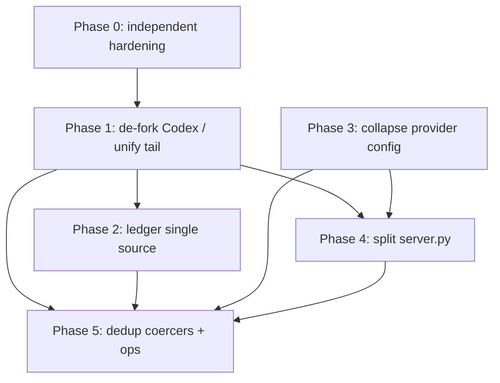

# Architecture Refactor Plan

Status: proposed
Scope: structural refactor of `ai_calls_router`, addressing findings from the
two adversarial reviews (line-level bugs and architecture). This document is
the contract for the work; it is intentionally exhaustive.

## How to read this document

- Phases are ordered by leverage, not by file. Earlier phases unblock later
  ones. Do them in order.
- Every phase carries the same six headings: Goal, Scope, Constraints &
  invariants, Steps, How to test, Done criteria — plus Rollback and Risk.
- File:line references were measured against the current tree. They will drift
  as edits land; re-measure inside each phase before editing.
- "Verify, don't assume" applies throughout. A claim about behaviour without a
  `file:line` is not actionable.

---

## Global invariants (every phase must preserve these)

These are the load-bearing properties of the proxy. A refactor that breaks one
of these is a regression regardless of how clean the diff looks. Each has a
named regression check that must stay green across all phases.

1. **Routing never breaks a turn.** Any failure inside routing (bad config,
   upstream error, conversion error, missing credential) falls back to
   premium passthrough. The client must never receive a router-origin 5xx for
   a request that premium would have served.
   - Source: `_try_route` contract in `proxy/server.py` (the
     `_RouteAttempt`/fallback machinery, ~L573-698).
   - Check: `test_routing_failure_falls_back_to_passthrough` (exists / extend).

2. **Byte-identical cache prefix on the direct path.** The DeepSeek/direct path
   forwards the request body without re-serialization, reordering, or
   compression, because prefix-cache hits require byte-for-byte identical
   prefixes. No phase may introduce a `json.loads`/`json.dumps` round-trip on
   the direct send path.
   - Source: `routing/direct.py` `direct_call` (~L142) and the "input body
     never mutated" contract in `_prepare_routed_body`.
   - Check: golden-fixture byte equality test (see Global testing).
   - Memory: `deepseek-cache-byte-determinism`.

3. **Input body is never mutated in place.** Routing builds a new dict; the
   caller's bytes are untouched. Immutability rule, and required for (2).

4. **No secrets in logs or error bodies.** API keys, OAuth tokens, and
   `chatgpt_account_id` never appear in logs, metrics, ledger entries, or
   error responses returned to the client.
   - Check: `test_no_secrets_in_*` (extend to cover any new error path).

5. **Config is fail-open.** Malformed or missing config disables routing and
   serves passthrough; it never crashes startup or a request.
   - Source: `_assemble_routes_fail_open` (`proxy/server.py` ~L182-203),
     `provider_config.load_provider_files` skip-on-error (~L57-77).

6. **Accounting is append-only and replayable.** The JSONL ledger is the
   durable record; restarting the process and replaying the ledger must
   reproduce the same aggregate totals that were live before restart. (This
   invariant is currently *not enforced by a test* — Phase 2 makes it one.)

7. **Direct paths decide nothing.** `routing/direct.py` and
   `routing/codex_direct.py` serve an already-chosen tier; they must not
   contain provider selection, tier resolution, or escalation logic. The
   routing decision and the escalation decision live in `decide`/`engine`. A
   "direct" path that grows a decision is a fork in the making.
   - Current violation: `codex_direct.response_escalates` (~L88-105) is a
     second escalation engine — removed in Phase 1.
   - Check: a structural guard that `direct.py`/`codex_direct.py` do not import
     `decide` and do not define selection/escalation functions.
   - Note: verified — `decide.py` imports no accounting, and accounting is
     written only in `engine`'s recording tail (`_record_metrics`,
     ~L318+). Routing decisions never read metrics; keep it that way.

---

## Global testing & done conventions

Applies to every phase; not repeated per-phase except where extended.

- **Write tests from the spec, not the implementation.** Read signature +
  docstring + contract; derive expected values independently. A test that
  passes against a known-broken mutation is worthless.
- **Test gates are the Makefile targets**, not ad-hoc commands:
  - `make test` — suite must pass.
  - `make coverage` — **fails under 95%** (this repo is stricter than the
    80% global default; do not lower it).
  - `make type` — pyright clean.
  - `make lint` — ruff clean.
  - `make check-cognitive` — every function ≤15 cognitive complexity.
  - `make check-complexity` — xenon/lizard ceilings hold.
  - `make qa` — the full blocking gate; a phase is not done until `qa` is green.
- **Test harness** lives in `tests/acr_testkit.py`: `FakeLitellm`,
  `Upstream` (httpx mock transport), `make_client(config_yaml, tmp_path,
  monkeypatch, upstream)`, `read_ledger(tmp_path)`. Reuse it; do not hand-roll
  a second harness.
- **Byte-determinism golden test**: the direct-path body for a fixed input
  must equal the committed golden fixture byte-for-byte. If a phase touches any
  serialization on the direct/codex path, this test guards invariant (2).
- **Done criteria, universal:** `make qa` green; no net new public surface
  beyond what the phase specifies; the phase's named regression checks added
  and passing; line/behaviour claims in the phase re-verified post-edit with a
  `diff` read.

---

## Risk register (cross-cutting)

| Risk | Where it bites | Mitigation |
|------|----------------|------------|
| Silent accounting drift | Phase 1, 2 | Replay-equals-live test (inv. 6); compare ledger aggregate to live snapshot in an integration test. |
| Cache-hit rate regression | Phase 1 | Byte-determinism golden test on the codex/direct path; do not route the body through Anthropic conversion. |
| Fallback path regression | all | Inv. 1 check stays in the suite; add a fault-injection test per touched path. |
| Config behaviour change | Phase 3 | Snapshot the assembled-routes output for representative configs before/after; assert equal. |
| God-file split changes import side effects | Phase 4 | Move code, do not rewrite it; keep `create_app` import graph identical; run the full integration suite, not just unit. |

---

## Phase 0 — Independent hardening (ship first, no structural change)

### Goal
Land the low-risk, high-confidence bug fixes that are *orthogonal* to the
structural work, so they ship without waiting on the refactor and shrink the
diff noise in later phases. None of these change module boundaries.

### Scope (files)
- `proxy/passthrough.py` — `_bad_gateway` (~L233-246) leaks `{exc}` into the
  client 502 body; `HOP_BY_HOP_REQUEST_HEADERS` (~L31) does not strip inbound
  `x-acr-*` headers.
- `proxy/websocket_passthrough.py` — `_relay_both` (~L163-182) reads
  `task.result()` on cancelled tasks; `_upstream_to_client` (~L206-217)
  catches only `ConnectionClosed`.
- `ops/daemon.py` — `start` (~L118-157): TOCTOU between `status()` and
  `Popen` (~L142); non-atomic pidfile `write_text` (~L148).
- `accounting/ledger.py` / writer — ledger file created without restrictive
  permissions (it can contain prompt-derived token counts and model names).
- `_lib/conversion.py` — `json.dumps(tu.get("input", {}))` without
  `sort_keys` (~L203): tool-input serialization is order-unstable, which can
  perturb downstream byte-determinism for the *converted* path.

### Constraints & invariants
- Invariants 1, 2, 4 apply directly here (502 body is an error-leak surface;
  conversion sort_keys touches the converted-path prefix).
- No behaviour change for the happy path — these are failure-path and
  hardening fixes.

### Steps
1. `_bad_gateway`: return a generic upstream-failure message; log `{exc}`
   server-side at WARNING with request-id, never in the response body.
2. Strip inbound `x-acr-*` from forwarded headers so a client cannot spoof
   internal routing/correlation headers; add them to the hop-by-hop strip set.
3. WS `_relay_both`: await/cancel pending tasks correctly; do not call
   `.result()` on a cancelled task. Catch `WebSocketDisconnect` and
   `RuntimeError` in `_upstream_to_client`, not just `ConnectionClosed`.
4. `daemon.start`: make pidfile write atomic (`O_CREAT|O_EXCL` or write-temp+
   `os.replace`); treat an existing live pid as "already running" rather than
   racing a second `Popen`. `# ponytail: single-host daemon, file lock is
   enough; revisit if multi-host.`
5. Create the ledger file with `0o600` (owner-only) on first write.
6. Add `sort_keys=True` to the tool-input `json.dumps` in conversion.

### How to test
- `test_bad_gateway_body_has_no_exception_detail` — assert the 502 body
  contains no exception text and no upstream URL; assert the detail *is*
  logged server-side (capture logs).
- `test_forwarded_headers_strip_x_acr` — client sends `x-acr-foo`; assert it
  is absent from the upstream request the `Upstream` mock receives.
- WS: `test_relay_handles_upstream_disconnect`,
  `test_relay_cancels_without_result_error` (inject a disconnect; assert no
  unhandled exception, both directions torn down).
- `test_daemon_double_start_is_idempotent` — two `start()` calls produce one
  process and a valid pidfile.
- `test_ledger_file_is_owner_only` — stat the ledger; assert mode `0o600`.
- Conversion golden test re-generated and byte-equal with sort_keys.

### Done criteria
`make qa` green; the six tests above added and failing-before/passing-after;
no change to any happy-path test.

### Rollback
Each fix is an isolated commit; revert individually. No data migration.

### Risk
Low. The only behaviour-visible change is the 502 body text and the dropped
`x-acr-*` headers; both are intended.

---

## Phase 1 — De-fork Codex (unify the routed recording tail)

### Goal
Collapse the Codex/Responses routed path back into the engine's single
recording tail. This is the highest-leverage phase: it **fixes the routed-call
accounting bug** (Codex routes record `incr_routed()` but skip savings, token,
and per-request accounting) *and* removes ~4 duplicated responsibilities that
exist only because Codex forked away from the engine.

### Why first
The fork is the root cause that the architecture review and the bug review
both point at. Every later phase is easier once routed paths share one tail:
Phase 2 (single accounting source) assumes all routes record the same way;
Phase 4 (server split) is smaller once `_try_codex_direct_route` and its four
helpers collapse.

### Background (verified post-edit)
- The engine now has the shared shape: `routed_call` (`routing/engine.py:441`)
  dispatches `_serve_via_direct` (`routing/engine.py:340`) vs
  `_serve_via_litellm` (`routing/engine.py:290`) and records through
  `record_route_outcome` (`routing/engine.py:387`).
- Response-guard escalation is one decision fed by two walkers:
  `premium_tool_names_from_anthropic` (`routing/engine.py:262`) and
  `premium_tool_names_from_responses` (`routing/engine.py:276`).
- The Codex path still serves Responses natively. `proxy/server.py`
  `_try_codex_direct_route` (`proxy/server.py:391`) calls
  `codex_direct.responses_call` (`routing/codex_direct.py:187`) and then the
  same `record_route_outcome` tail; `_handle_routed_request`
  (`proxy/server.py:774`) no longer needs a Codex-specific metrics recorder.
- Duplicated helpers removed by this phase:
  - `codex_direct.response_escalates`
  - `server._codex_response_usage`
  - `server._codex_savings_body`
  - `server._record_codex_http_route_attempt`

### Decision: shared tail, not full wire conversion
Two ways to de-fork:
- (A) Convert the Responses reply to Anthropic, push it through the existing
  engine tail, then render back to Responses via the already-existing
  `OpenAIResponsesAdapter` (`adapters/openai_responses.py`, which already has
  all four adapter methods).
- (B) Keep Codex serving Responses natively, and extract the engine tail into
  a transport-agnostic `record_route_outcome(...)` that takes a *normalized
  usage struct* and is called by both the generic tail and the Codex path.

**Choose (B).** Rationale: (A) adds two conversions (Responses→Anthropic→
Responses) on every Codex call purely to reuse the tail, and risks invariant
(2) by round-tripping the body. (B) fixes the actual bug (missing recording)
with no added conversion and no new byte-serialization on the hot path. The
adapter-render route (A) is a *possible later cleanup*, not required to fix the
bug — note it and move on. `# ponytail: share the tail, don't re-plumb the wire.`

### Scope (files)
- `routing/engine.py` — extract the recording tail of `routed_call` into a
  single internal function that takes a normalized result (model, tier,
  normalized usage, tool names, agent/session/request metadata).
- `accounting/savings.py` / `accounting/metrics.py` — no new public API; the
  extracted tail calls existing `record_savings_from_response`-equivalent and
  `record_request`/`add_routed_tokens`/`add_savings`. If a normalized-usage
  entry point is cleaner than the response-shaped one, add it *once* here, not
  in server.
- `routing/codex_direct.py` — `responses_call`
  (`routing/codex_direct.py:187`) returns its normalized usage; escalation
  predicate shared with the engine.
- `proxy/server.py` — `_try_codex_direct_route`, `_codex_response_usage`,
  `_codex_savings_body`, `_record_codex_http_route_attempt` shrink to: build
  normalized usage, call the shared tail. Delete the duplicated helpers.
- **Auth-mode convergence** (from external review): credential/auth resolution
  is currently split — `decide.resolve_tier_credential`
  (`routing/decide.py:470`) picks the credential for a tier, while
  `codex_direct._chatgpt_oauth_headers` now only shapes already-resolved OAuth
  headers. While this phase is already in `codex_direct`, converge the "which
  auth mode for this tier" decision into the credential resolver so the Codex
  path *consumes* a resolved credential + mode rather than re-deciding. This is
  the concrete, grounded version of the review's "capabilities layer" — no new
  module, just one decision site.
  `# ponytail: one credential resolver, not a capabilities framework.`

### Constraints & invariants
- **Invariant 2 is the sharp edge.** Do not convert the Codex body through
  Anthropic for accounting; extract usage from the Responses reply and
  normalize the numbers only. The bytes sent upstream are unchanged.
- **Invariant 6**: after this phase, a routed Codex call writes the same kinds
  of ledger/metrics entries as a routed DeepSeek call (savings + tokens +
  request row), differing only in `model`/`wire`.
- **Invariant 1**: a Codex failure still falls back to premium; the shared tail
  runs only on success.
- The escalation predicate must stay two thin wire-walkers (Anthropic
  `content[]`, Responses `output[]`) feeding **one** decision; do not try to
  unify the walkers.

### Steps
1. Define the normalized usage struct (the four token buckets the savings/
   metrics code already consumes: input/non-cached, output, cache_read,
   cache_creation) plus model/tier/tool-names. Reuse the existing dataclass if
   one exists; otherwise add it next to the engine tail, not in server.
2. Extract `routed_call`'s tail (escalation check → savings → metrics) into
   `record_route_outcome(normalized, ...)`. Make `routed_call` call it.
3. Have `codex_direct.responses_call` return its normalized usage alongside the
   body (it already extracts the numbers; surface them instead of re-deriving
   in server).
4. Replace the body of `_try_codex_direct_route`'s recording with a single
   `record_route_outcome(...)` call. Delete `_codex_response_usage`,
   `_codex_savings_body`, and the now-redundant attempt recorder.
5. Replace `codex_direct.response_escalates` with the shared decision fed by a
   Responses `output[]` walker; keep the Anthropic walker for the generic path.
6. Re-measure all the line refs above and update any stale ones in this doc.

### How to test
- **Bug-fixing regression (the headline):**
  `test_routed_codex_call_records_savings_and_tokens` — drive a routed Codex
  request through `make_client`, then `read_ledger(tmp_path)` and assert the
  entry has non-zero/derived savings, token buckets, and a request row — not
  just a routed counter bump. This test must **fail on `main`** (proving it
  catches the current bug) and pass after.
- **Parity:** `test_codex_and_deepseek_record_same_shape` — a routed Codex and
  a routed DeepSeek call produce ledger entries with the same field set.
- **Escalation:** `test_codex_response_escalation_promotes_to_premium` and the
  Anthropic equivalent both exercise the one shared decision.
- **Cross-adapter tool-detection parity (from external review):**
  `test_tool_detection_parity_across_wires` — express the *same logical
  tool-result turn* in all three inbound shapes (Anthropic messages, OpenAI
  chat, OpenAI responses), run each through `adapter_for_path` →
  `extract_pending_tools` / `decide.pending_tool_names` → tier decision, and
  assert the detected tool-name set and the chosen tier are **identical**
  across all three. This is the guard against the highest-risk divergence the
  review names (tool calls behaving differently per protocol). Parametrize it;
  add a premium-tool case so escalation parity is covered too.
- **Byte-determinism:** golden test confirms the Codex upstream body is
  unchanged (no Anthropic round-trip introduced).
- **Fallback:** `test_codex_upstream_error_falls_back_to_premium`.
- **Direct-paths-decide-nothing (invariant 7):**
  `test_direct_modules_contain_no_decision_logic` — assert `direct.py` and
  `codex_direct.py` do not import `decide` and define no
  selection/escalation function (this fails on `main` because of
  `response_escalates`).
- Mutation mindset: flip the escalation comparison and the
  savings-record call site; each must break a test.

### Done criteria
`make qa` green; the headline regression test fails on `main` and passes here;
`_codex_response_usage` and `_codex_savings_body` deleted; `response_escalates`
folded; routed Codex and routed DeepSeek ledger rows are field-identical;
invariant 7 holds (`codex_direct` imports no `decide`, defines no escalation);
auth mode is resolved in one site; cross-adapter tool-detection parity test
passing.

### Rollback
Single feature branch. The extraction (step 2) is behaviour-preserving and can
land separately from the Codex wiring (steps 3-5), so rollback can drop the
Codex wiring while keeping the tail extraction.

### Risk
Medium. The accounting numbers are the product; the parity + replay tests are
the guard. The byte-determinism test guards the cache invariant.

---

## Phase 2 — Ledger as the single source of truth

### Goal
Eliminate the dual accounting source. Today live counters
(`accounting/metrics.py` `_Metrics`) and the durable JSONL ledger are written
on separate code paths, and on restart `bootstrap` re-implements aggregation
that `ledger.aggregate` already does. They can silently diverge.

### Background (verified)
- `ledger.aggregate(entries) -> Summary` (`accounting/ledger.py` ~L112) already
  computes historical totals from ledger entries.
- `metrics.bootstrap` (~L374) replays the ledger through
  `_BootstrapAccumulator` (~L274-407), whose `_build_recent_entry` (~L322)
  duplicates the row shape built by `record_request` (~L189).
- `snapshot` (~L411-456) returns references to live structures (a separate
  concurrency concern, see below).

### Constraints & invariants
- **Invariant 6 becomes enforced here**: replaying the ledger must reproduce
  the live aggregate. This phase's headline test *is* that invariant.
- Live counters are still needed for the dashboard's at-a-glance view; the goal
  is one *writer of truth* (the ledger) and a derived in-memory view, not the
  removal of live counters.
- `snapshot` must return copies, not live references, so a concurrent writer
  cannot mutate a snapshot mid-serialization.

### Steps
1. Make `bootstrap` delegate historical aggregation to `ledger.aggregate`
   instead of re-summing in `_BootstrapAccumulator`. Delete
   `_build_recent_entry` if `record_request`'s builder can be reused for the
   "recent" tail (single row-builder).
2. Define the live snapshot as: `ledger.aggregate(history)` + the deltas
   recorded since process start. One code path appends to the ledger; the live
   counters are derived, not independently authoritative.
3. `snapshot` returns deep-copied/immutable data.
4. Collapse `ledger`'s private `_json_int`/`_json_float` into the shared
   coercers introduced in Phase 5 (or pull that one helper forward if it
   unblocks this phase).

### How to test
- **Headline (invariant 6):** `test_ledger_replay_equals_live_aggregate` —
  record a known sequence of routed/premium calls live, capture the live
  snapshot totals, construct a fresh metrics object, `bootstrap` from the same
  ledger, assert the bootstrapped aggregate equals the live totals field-for-
  field. Must fail if the two row-builders drift.
- `test_snapshot_is_isolated_from_concurrent_writes` — take a snapshot, mutate
  live state, assert the snapshot is unchanged.
- `test_aggregate_matches_record_request_fields` — the row shape from the
  recent-tail builder equals `record_request`'s shape (guards the de-dup).

### Done criteria
`make qa` green; `_build_recent_entry` removed (or reduced to a call into the
shared row builder); replay-equals-live test passing; `snapshot` returns copies.

### Rollback
Behaviour-preserving for readers; revert restores the dual path. No on-disk
format change (ledger schema is untouched).

### Risk
Medium. Risk is a subtle totals mismatch; the replay-equals-live test is the
exact guard and should be written first (it will fail on `main`).

---

## Phase 3 — Collapse the Phase-7 multi-file provider config

### Goal
The biggest pure-deletion win. The per-provider YAML system
(`routing/provider_config.py`, ~232L) layers file discovery, per-group
validation, fallback synthesis, mtime caching, and route assembly on top of the
already-capable single config. Reduce it to the minimum that the actual three
groups (`claude_code`, `codex`, `hermes`) need.

### Background (verified)
- `provider_config.py` exposes `load_provider_files`, `assemble_routes`,
  `resolve_agent_group`, plus `_validate_provider_payload`,
  `_fallback_agent_config`, `_provider_agent_config`, and a stack of small
  resolver helpers (`_user_agent_match`, `_endpoint_default`,
  `_fallback_group`).
- `proxy/server.py` adds a *second* caching layer around it:
  `_file_signature` (~L166-172), `_assembled_routes_signature` (~L175-179),
  `_assemble_routes_fail_open` (~L182-203), `_load_assembled_routes` (~L206).
- `KNOWN_GROUPS` is fixed to three. Much of the generality (arbitrary provider
  files, per-file validation, fallback synthesis) serves a plurality that does
  not exist. YAGNI.

### Constraints & invariants
- **Invariant 5 (fail-open) must hold**: a malformed or missing provider file
  still disables routing for that group and serves passthrough.
- Identity resolution precedence must be unchanged: explicit group → user-agent
  match → endpoint default → adapter default. (This precedence was a
  deliberate decision; preserve it.)
- The assembled-routes output for representative real configs must be
  **byte/semantically identical** before and after — this phase is a
  simplification, not a behaviour change.

### Steps
1. Snapshot the current `assemble_routes` output for: (a) single global config,
   (b) global + one provider file, (c) global + all three. These become golden
   fixtures and the regression oracle.
2. Collapse the two caching layers into one. The server-side signature cache
   and the provider-config loader both stat files; pick one mtime-keyed cache.
3. Inline or delete helpers that exist only to support arbitrary providers:
   fold `_provider_agent_config`/`_fallback_agent_config` into a single
   group-config resolver if the three known groups don't need the split.
4. Keep `resolve_agent_group` and its precedence; simplify its internals if the
   resolver helpers can merge without losing the precedence order.
5. Re-run the golden comparison; any diff is a bug in the simplification.

### How to test
- **Headline:** `test_assembled_routes_unchanged_after_collapse` — the three
  golden fixtures from step 1 compared before/after; must be equal.
- `test_resolve_group_precedence` — explicit > UA > endpoint > adapter-default,
  one case each, including the adapter-default fallback (regression for the
  precedence decision).
- `test_malformed_provider_file_fails_open` — a broken provider YAML disables
  that group's routing and the request is served via passthrough.
- `test_provider_file_deletion_is_detected` — delete a provider file; the
  cache invalidates and assembled routes update (this was a real fixed bug;
  keep its guard).

### Done criteria
`make qa` green; net negative line count in `provider_config.py` + the
server-side cache helpers; golden-routes equality test passing; precedence and
fail-open tests passing.

### Rollback
Pure-deletion phase; revert restores the prior helpers. The golden fixtures
stay regardless (they are useful permanently).

### Risk
Medium-low. The golden equality test makes "did behaviour change?" a
mechanical check. Risk is missing a config shape in the golden set — include
the deletion and malformed cases explicitly.

---

## Phase 4 — Break up the `server.py` god-file

### Goal
`proxy/server.py` is ~1036 lines and mixes: HTTP route handlers, the routing
decision orchestration, Codex HTTP/WS specifics, config assembly + caching,
dashboard/metrics endpoints, and small accounting helpers. Split by
responsibility so each module is under the 800-line ceiling and has one job.
This phase is mostly *moves*, made small by Phases 1 and 3.

### Why after 1 and 3
Phase 1 deletes the Codex helpers (`_codex_response_usage`,
`_codex_savings_body`) and shrinks `_try_codex_direct_route`. Phase 3 deletes
the config-assembly/caching cluster (`_file_signature`,
`_assembled_routes_signature`, `_assemble_routes_fail_open`,
`_load_assembled_routes`). What remains to split is much smaller.

### Scope (target modules)
- `proxy/server.py` keeps: the Starlette app wiring (`create_app` ~L1003,
  `_lifespan` ~L974), the route handlers (`messages`, `chat_completions`,
  `responses`, `responses_ws*`, `proxy`), and `health`/`metrics`/`dashboard`
  endpoints.
- Move routing orchestration (`_try_route`, `_resolve_tier_config`,
  `_premium_guard_attempt`, `_routed_fallback_attempt`, `_handle_routed_request`,
  `_wants_stream`) into a `proxy/route_dispatch.py` (or `routing/` if it
  belongs with the engine — decide by import direction: it depends on engine +
  adapters, so it sits above them).
- Move the WS routing entry (`_record_ws_route_attempt`,
  `_try_route_ws_response_create`) next to the WS passthrough.
- Move the remaining accounting shims into `accounting/` (they should be thin
  after Phase 1).
- `_serve_dashboard`/`dashboard`/`metrics_endpoint` can move to a
  `proxy/observability.py`.

### Constraints & invariants
- **Pure moves, not rewrites.** Cut/paste functions; do not "improve" them in
  the same commit. Behaviour must be identical.
- The `create_app` import graph and the registered route table must be
  identical (same paths, same handlers, same order where order matters).
- No circular imports: dispatch depends on engine/adapters; server depends on
  dispatch; nothing depends back on server.
- All invariants 1-6 are carried by the moved code unchanged.

### Steps
1. Draw the target module boundaries (one short Mermaid diagram in the PR).
2. Move one cluster per commit: dispatch, then WS, then observability, then
   accounting shims. Run `make test` after each move.
3. Keep public import paths stable where other modules/tests import from
   `proxy.server`; re-export if needed to avoid churning the test suite in the
   same PR.
4. Confirm each resulting file is < 800 lines and each function ≤15 cognitive.

### How to test
- The **existing integration suite is the oracle** — moves must not change any
  passing test. Run `make test` after every commit, not just at the end.
- `test_route_table_unchanged` — assert the set of `(path, methods, handler
  name)` registered by `create_app` is identical before/after (snapshot it
  first).
- `make check-cognitive` and `make check-complexity` must pass on the new
  modules (the split should *lower* per-file complexity).
- No new tests of behaviour are expected; if a move "needs" a new test, the
  move changed behaviour — stop and fix.

### Done criteria
`make qa` green; `proxy/server.py` < 800 lines and limited to app wiring +
handlers; route-table snapshot equal; no circular imports (pyright/import
check clean).

### Rollback
Per-cluster commits; revert any single move. Because moves are
behaviour-preserving, partial rollback is safe.

### Risk
Low mechanically, but high blast radius if an import side effect moves. The
route-table snapshot + full integration run are the guards. Do not combine with
any behaviour change.

---

## Phase 5 — Consolidate duplicated utilities and `ops` sprawl

### Goal
Mop-up. Remove the duplicated int/float coercers and tidy the `_lib`/`ops`
organization now that the hot paths are settled. Smallest phase; do it last so
it isn't churned by 1-4.

### Scope (files)
- Duplicated coercion: `engine._usage_int` (~L111), `engine._json_int` (~L116),
  `server._usage_int` (~L115-124), `ledger._json_int`/`_json_float`. Three+
  copies of "coerce a JSON value to int/float, defensively". Collapse to one
  home (e.g. `_lib/jsonnum.py`) and import it everywhere.
- `_lib` reorganization: confirm config constants
  (`DEFAULT_HOST="127.0.0.1"`, `DEFAULT_PORT`, `DEFAULT_UPSTREAM`) and the
  conversion utilities sit in coherent modules; split if any `_lib` module is
  doing two jobs.
- `ops/daemon.py`: after Phase 0's correctness fixes, check whether the daemon/
  status/ops surface is larger than the one host it manages needs. Trim only
  what is provably unused (`make vulture` as an advisory pointer, then verify
  by reference search — do not delete on the tool's word alone).
- **Optional tidy (from external review):** there are three top-level
  `synthesis*.py` files (`synthesis.py`, `synthesis_openai.py`,
  `synthesis_responses.py`). Grouping them into a `routing/synthesis/` package
  mirrors the existing `routing/adapters/` convention and is the *only*
  subpackage split worth doing — it reflects a real cluster, not invented
  structure. Low value; do it only if it falls out naturally, otherwise skip.
  `# ponytail: mirror adapters/ if it's free; not worth a churny PR on its own.`

### Constraints & invariants
- Behaviour-preserving. The coercers must keep their exact defensive semantics
  (what they return for `None`, missing, wrong-type, float-for-int). Derive
  those semantics from the *callers'* expectations and lock them in a test
  before consolidating.
- No public API removal without a reference search proving zero internal/test
  callers (verify, don't assume).

### Steps
1. Write the spec test for the unified coercer first (boundary cases: `None`,
   `"3"`, `3.0`, `"x"`, missing key, negative). Derive expected values from how
   each current caller relies on them — if two callers disagree, that
   disagreement is a latent bug; surface it to the user rather than papering
   over it.
2. Introduce the single coercer; replace each duplicate with an import; delete
   the duplicates.
3. Reorg `_lib` only where a module has two responsibilities; otherwise leave
   it (YAGNI).
4. Trim provably-dead `ops` code with reference-search evidence.

### How to test
- `test_jsonnum_coerce_boundaries` — the full boundary table; this is the
  contract for all former call sites.
- Existing engine/ledger/server tests must stay green (they exercise the
  coercers indirectly).
- `make check-deps` (deptry) clean — no orphaned imports left behind.

### Done criteria
`make qa` green; one coercer module imported by engine/ledger/server; the
duplicates deleted; `make check-deps` clean; any `ops` deletions backed by a
referenced "zero callers" search in the PR.

### Rollback
Trivial; revert the consolidation commit. The boundary test stays.

### Risk
Low. The only trap is a semantic difference between the duplicate coercers;
the boundary spec test written first catches it.

---

## Sequencing summary

- Phase 0 is independent and ships first.
- Phase 1 unblocks Phase 2 (single recording path) and shrinks Phase 4.
- Phase 3 is independent of 1/2 but shrinks Phase 4; do it before 4.
- Phase 4 is the big move, made small by 1 and 3.
- Phase 5 is mop-up; last so it isn't re-churned.

## Architecture Decision Records (ADRs)

Cheap, doc-only, and high-leverage: an ADR pins *why* a structural choice was
made so a future maintainer (or a future LLM review like the one this section
reconciles) does not "helpfully" undo it. Write these alongside the phases.

- **ADR-0001 — Anthropic Messages is the canonical internal contract, and the
  Codex/Responses path deliberately bypasses it.** Record that adapters
  translate to/from Anthropic Messages (the hub), AND that the Codex path is
  the one intentional exception: it serves Responses natively to preserve
  prefix-cache byte-determinism (invariant 2). State explicitly that routing
  the Codex body through Anthropic conversion to "unify" it would regress the
  cache hit rate — this is the trap an outside reviewer will recommend, and the
  ADR is the standing answer. Tie to memory `deepseek-cache-byte-determinism`.
- **ADR-0002 — Routing decisions never read accounting; direct paths never
  decide.** Records invariants 6/7 and why (passive metrics, no forks). Cite
  that `decide.py` imports no accounting and `_record_metrics` is the only
  write site.

Place ADRs in `docs/adr/`. Write ADR-0001 *with Phase 1* (it is the
justification for the shared-tail-not-conversion decision); ADR-0002 with
Phase 2.

## External review reconciliation

A second LLM reviewed the architecture at the package level. Recorded here so
the adopt/reject decisions are auditable rather than silently absorbed. The
reviewer did not have file:line access, so its prescriptions were judged
against the actual tree.

Adopted (folded into the phases above):

| Point | Where it landed | Why it was real |
|-------|-----------------|-----------------|
| Tool-call behaviour diverges across OpenAI chat/responses/Anthropic | Phase 1 cross-adapter parity test | Genuinely untested seam; `_function_call_events` + per-adapter `extract_pending_tools` are protocol-specific. |
| Keep `direct.py`/`codex_direct.py` narrow, not mini-routing engines | Invariant 7 + Phase 1 | Verified violation: `codex_direct.response_escalates` is a 2nd escalation engine. |
| Capability/auth resolution is a coupling axis | Phase 1 auth-mode convergence | Verified split: `decide.resolve_tier_credential` vs `codex_direct._oauth_headers`. |
| Add an ADR | ADR-0001/0002 above | Codebase is past the point where the "why" should live only in heads. |
| `synthesis*` could be its own subpackage | Phase 5 optional tidy | Real cluster (3 files), mirrors existing `adapters/`. |

Rejected (with reason):

- **Split `routing/` into 6 subpackages (decision/provider/adapter/synthesis/
  direct/contracts).** This plan *shrinks* routing (Phase 1 collapses the Codex
  fork, Phase 3 collapses provider config). Subdividing ~10 files into 6 dirs
  is churn that adds navigation cost without reducing coupling. YAGNI.
- **Strategy objects for OpenAI/Anthropic/Codex/WS compatibility fallbacks.**
  Factory/strategy indirection for a fixed `KNOWN_GROUPS = {claude_code, codex,
  hermes}` is a factory-for-three-products. The adapter Protocol already
  provides the polymorphism; strategy objects on top are ceremony.
- **A standalone "capabilities resolution" module.** Speculative. The only
  concrete duplication (auth mode) is fixed by Phase 1's one-site convergence;
  there is no second axis duplicated enough to justify a module.
- **"Introduce one canonical internal contract."** Already exists — Anthropic
  Messages is the hub and adapters translate to/from it. The sole violation is
  the Codex bypass, which is intentional (ADR-0001) and whose accounting gap is
  closed by Phase 1. Nothing to build.
- **"Metrics may start influencing routing."** Verified non-issue: `decide.py`
  imports no accounting; accounting is written only in `engine._record_metrics`
  after a successful call. Invariant 7's note keeps it that way.
- **"Synthesis may be doing hidden policy/fixup."** Verified non-issue today:
  `synthesis*` functions are pure SSE/event shapers with no selection or
  escalation. No action beyond the tool-call parity test that already covers
  its one risky surface.

## What this plan deliberately does not do

- It does not route the Codex body through Anthropic conversion (would risk the
  cache invariant for no bug-fix benefit). The adapter-render cleanup is noted
  in Phase 1 as optional future work, not scheduled.
- It does not add new providers, new wire formats, or new config generality.
  The opposite: Phase 3 removes generality the three real groups don't use.
- It does not change the ledger on-disk schema (Phase 2 changes who aggregates,
  not the format).
- It sets no timelines and assigns no estimates by intent.
